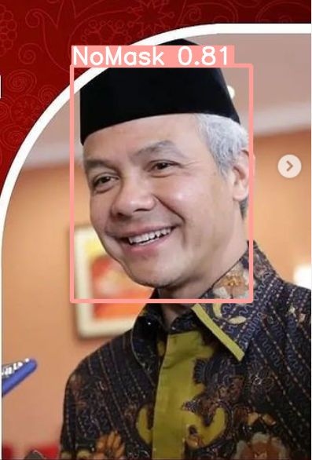

<h1 align="left"> 😷 Face mask detection 😷 </h1>

 

## 🔦 **Inference on Google Colab (Recommend)**
- **Open notebook and follow the instructions** 

## 🌟 **Train YOLOv5 models** 
- **Open notebook and follow the instructions** 

## 🌟 **Results**

    
    

## 🌟 **Experiments**
**Full experiment details on** 
    
 

**I personally train [yolov5s, yolov5m] models for 50 epochs, [yolov5l] model for 30 epochs [yolov5x] model for 10 epochs due to high computational expenses.**
    
### **Metrics**

    
    
    

### **Losses**

    
    

# 📙 **References**
- Inspire from: https://github.com/waittim/mask-detector
