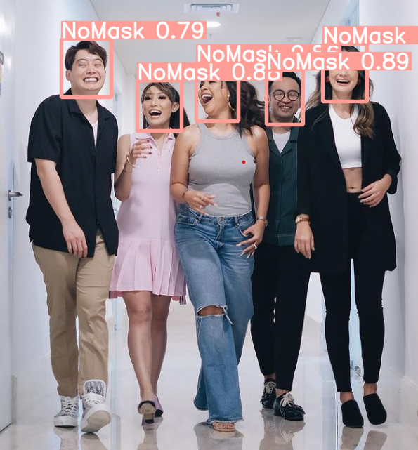

<h1 align="left"> 😷 Face mask detection 😷 </h1>

 

## 🔦 **Inference on Google Colab (Recommend)**
- **Open notebook and follow the instructions** 

## 🔦 **Train YOLOv5 models** 
- **Open notebook and follow the instructions** 

## 🔦 **Results**

    
    
    
    
    

## 🔦 **Experiments**
**Full experiment details on** 

 

**I trained yolov5m model for 50 epochs due to high computational expenses.**
### **Train Batch 1** 

    

### **Metrics and Losses**

    
    
    

# 📙 **References**
- Inspire from: https://github.com/waittim/mask-detector
